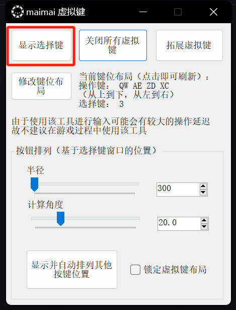
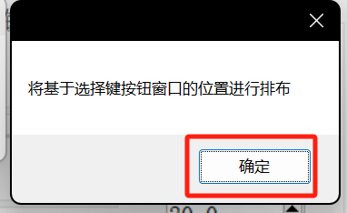
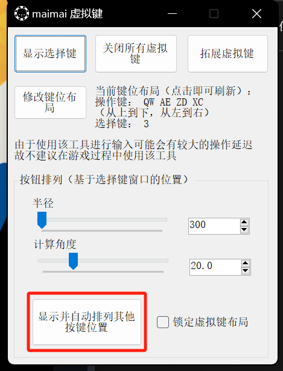
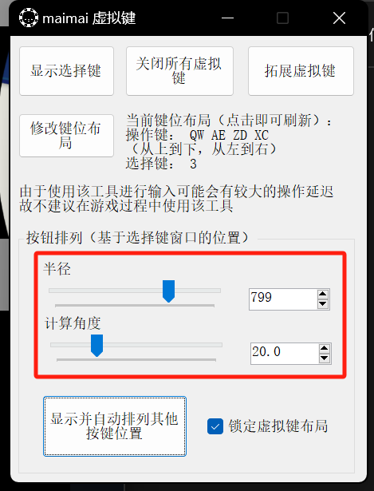
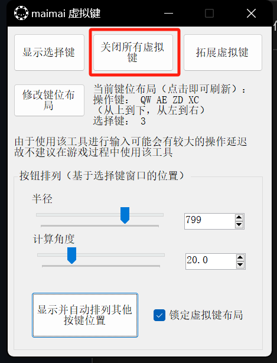
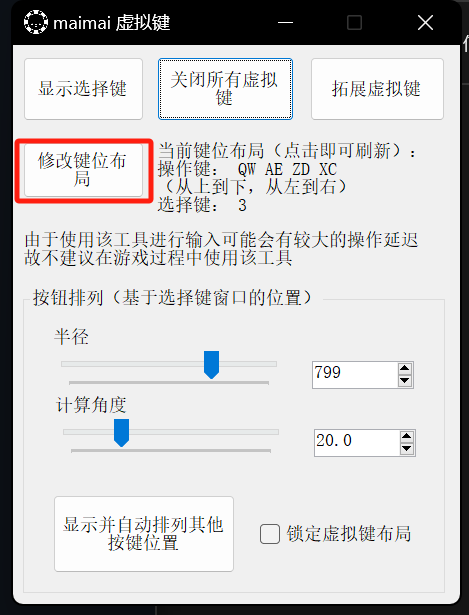
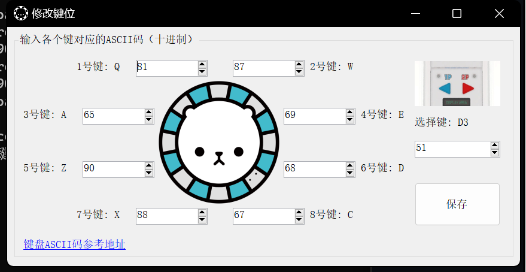

# maimai 虚拟键

### 一、如何使用

 1. [下载](https://github.com/Error063/maiKey/releases)程序

 2. 运行

 3. 点击“显示选择键”

    

 4. 点击确定

    

 5. 将选择键窗口拖拽至合适的位置

    

 6. 点击”显示并自动排列其他按键位置“

    

 7. 完成

    

注：您可以调节”半径“和”计算角度“来调节按钮的具体布局

要关闭所有虚拟键，请点击”关闭所有虚拟键“（需要先解除锁定）

若默认键位布局不合适，您可以通过点击”修改键位布局“来调整键位

